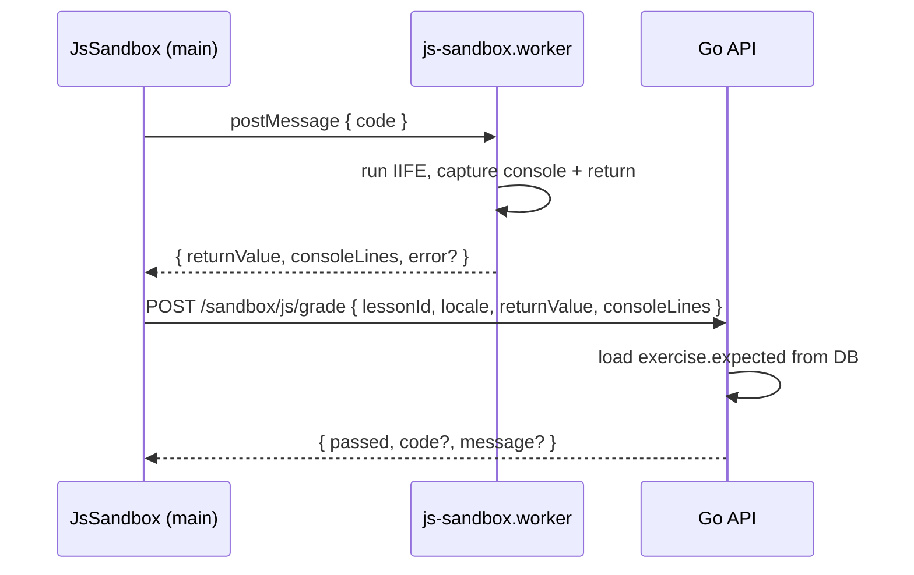

# Design: JavaScript code sandbox

## Architecture



## Worker protocol

**Inbound** (`main → worker`):

```json
{ "type": "run", "code": "...", "timeoutMs": 2500 }
```

**Outbound** (`worker → main`):

```json
{ "type": "result", "ok": true, "returnValue": 8, "consoleLines": [] }
```

```json
{ "type": "result", "ok": false, "error": { "code": "syntax", "message": "..." } }
```

Worker implementation notes:

- Use `new Function('console', '"use strict"; return (async () => { ... })()')` **inside the worker only**.
- Provide a stub `console` that pushes to an array.
- Reject `import`, `importScripts` (not exposed), and dynamic `Function` from learner code where feasible (static denylist for obvious escape hatches).
- Serialize `returnValue` with `JSON.parse(JSON.stringify(value))`; non-JSON values → grade error `non_serializable_return`.

## Grading (`gradeJs`)

| `expected.type` | Match rule |
|-----------------|------------|
| `returnValue` | `reflect.DeepEqual` on JSON-decoded values |
| `console` | Same length; each line `strings.TrimSpace` equal |

Failure codes: `wrong_result`, `no_expected`, `invalid_expected`, `non_serializable_return`.

## Lesson JSON hardening

Reuse `content.LessonForLearner` — already strips `expected` and `solution`. Add `solutionAvailable` when solution text exists (unchanged).

## Frontend

- New `JsSandbox.vue` — structurally similar to `SqlSandbox.vue` but calls worker then grade API.
- `[slug].vue`: render `JsSandbox` when `trackId === 'javascript-basics'` && `lesson.exercise`; keep `SqlSandbox` for SQL tracks.
- Shared `createSandboxUiState` for reset on lesson change.

## Security posture

Defense in depth for a **learning** app (not arbitrary code hosting):

1. Worker isolation (no DOM)
2. Hard timeout
3. Server holds answers
4. Auth required to grade / reveal solution

Sophisticated users can forge grade POST bodies; acceptable for self-paced learning. Do not claim bank-grade sandboxing.

## Testing

- Go: `internal/sandbox/js_grade_test.go`
- Node: `apps/web/scripts/check-js-sandbox-worker.mjs` (protocol + timeout)
- Smoke: extend `e2e` or add `check-js-sandbox.ps1` with register → grade pilot lesson
